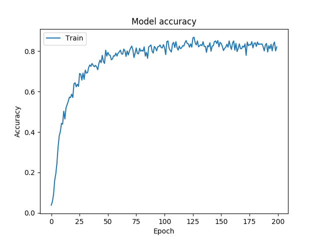
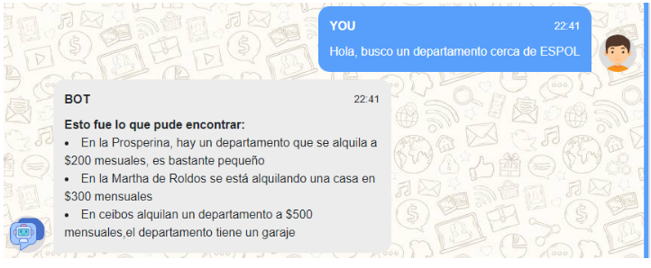
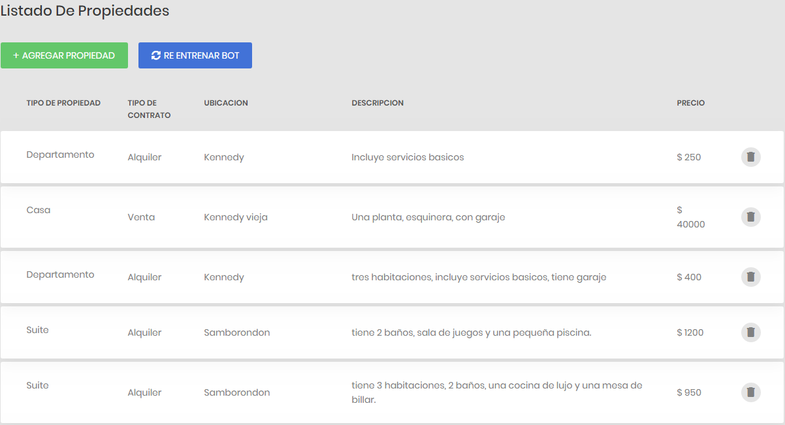
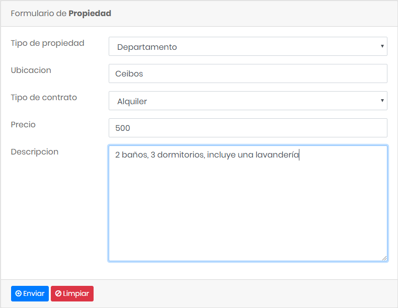

# Chatbot

1 - Crear entorno virtual
-------------------------------
* git clone https://github.com/davnm5/ChatBot-Distribuido
* cd ChatBot-Distribuido/chat-dist
* virtualenv -p python3 venv
* source venv/bin/activate

2 - Instalar 
---------------
* pip install -r requirements.txt

3 - Iniciar
---------------
* export FLASK_APP=app/main.py
* export FLASK_ENV=development
* flask run

4 - Acceso
----------------------
* Chat: localhost:5000/chat
* Lista de propiedades: localhost:5000/list
* Formulario de registro de propiedades: localhost:5000/form

4.- Resultados
-----------------------

5.- Documentación ChatBot-Distribuido (pendiente)
------------------------------------------------

6.- Autor:
--------------------------
José David Neira Martrus