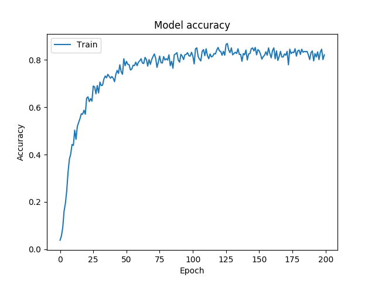
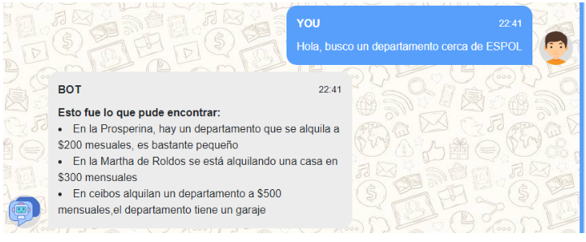
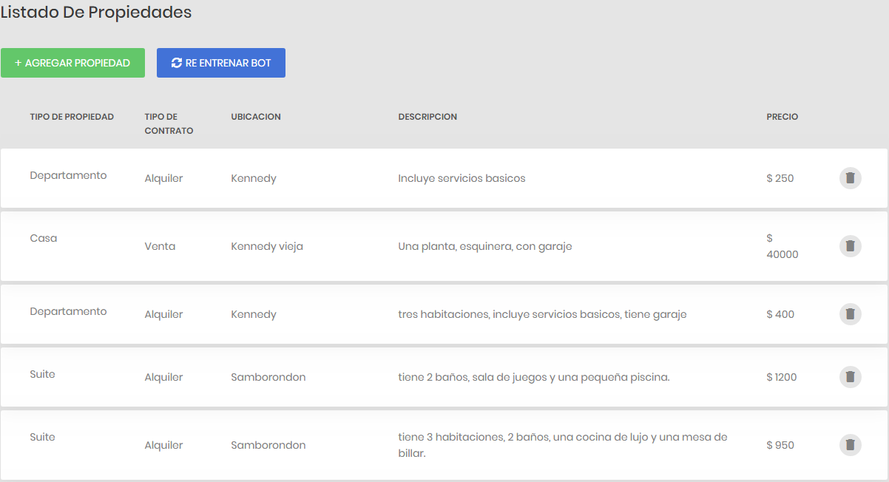
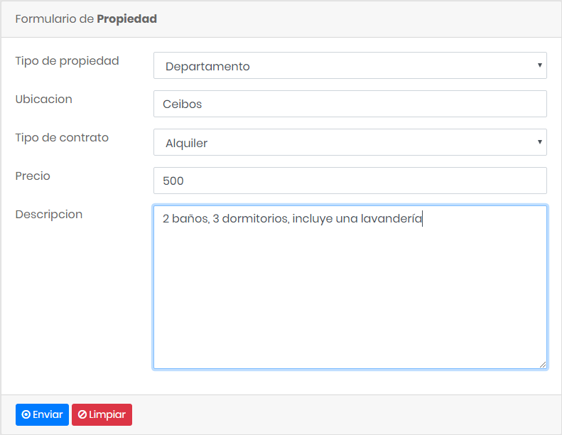

# Chatbot

1 - Crear entorno virtual
-------------------------------
* virtualenv -p python3 nombre_del_entorno
* cd nombre_del_entorno
* git clone https://github.com/Lu1sR/Chatbot
* source bin/activate

2 - Instalar 
---------------
* pip install -r requirements.txt

3 - Iniciar
---------------
* export FLASK_APP=app/main.py 
* flask run

4 - Acceso
----------------------
* Chat: localhost:5000/chat
* Lista de propiedades: localhost:5000/list
* Formulario de registro de propiedades: localhost:5000/form

4.- Resultados
-----------------------

